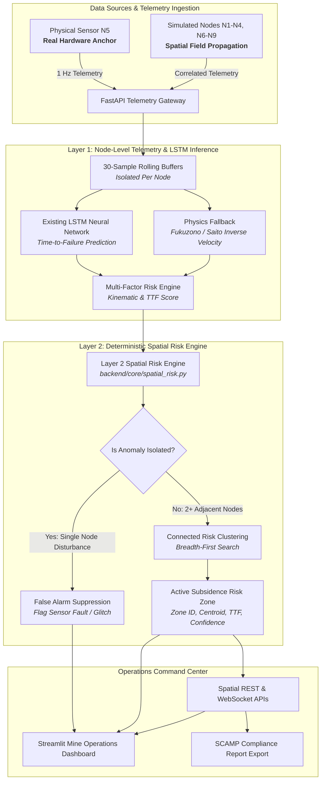

# STRATA-X — AI-Driven Real-Time Mine Subsidence Intelligence & Early Warning System

[](https://github.com/ananya01705/STRATA-X-AI-Driven-Real-Time-Mine-Subsidence-Intelligence-Early-Warning-System/actions)
[](https://fastapi.tiangolo.com)
[](https://streamlit.io)
[](https://python.org)

**STRATA-X** is an industrial-grade, edge-deployable early-warning platform for underground coal mine strata stability and subsidence forecasting. It combines a high-precision **Layer 1 LSTM Time-to-Failure (TTF) Model** with a deterministic **Layer 2 Spatial Risk Engine** across a 3×3 gallery sensor mesh.

---

## 🏛️ System Architecture



### Architectural Distinction
- **Layer 1 (Node Level):** *"What is happening at this specific gallery node?"* &mdash; Evaluates resultant tilt, deformation velocity, and predicts node-specific collapse Time-to-Failure (TTF) using a 30-sample sliding window and LSTM neural network.
- **Layer 2 (Spatial Field Level):** *"Is this movement an isolated hardware glitch or evidence of a coherent, multi-gallery subsidence zone?"* &mdash; Analyzes 3×3 neighborhood topology to detect connected clusters of abnormal movement while suppressing single-node false alarms.

---

## 🛰️ Physical Hardware vs. Software Simulation Transparency

STRATA-X explicitly differentiates real physical hardware measurements from simulated prototype nodes:

| Node ID | Role | Type | Description |
| :--- | :--- | :--- | :--- |
| **`NODE_05`** | **Physical Anchor** | **REAL HARDWARE** | Physical sensor installed at Gallery 2 Center Junction. Ground truth for spatial field propagation. |
| **`NODE_01` &ndash; `NODE_04`** | Prototype Nodes | Software Simulation | Spatially correlated sympathetic response based on distance from N5. |
| **`NODE_06` &ndash; `NODE_09`** | Prototype Nodes | Software Simulation | Spatially correlated sympathetic response based on distance from N5. |

### Physics-Informed Spatial Field Propagation
Simulated nodes do **not** generate independent random values. Instead, deformation and velocity propagate outward from the physical anchor ($N_5$) via an exponential distance attenuation decay:
$$\Delta d_i = \Delta d_{\text{anchor}} \cdot \exp(-\alpha \cdot \text{dist}(N_i, N_{\text{anchor}})) + \epsilon_i$$
Where orthogonal gallery neighbors ($N_2, N_4, N_6, N_8$) exhibit strong-to-moderate coupling, and diagonal corner nodes ($N_1, N_3, N_7, N_9$) exhibit attenuated sympathetic response.

---

## 🚀 Key Features

1. **3×3 Mine Sensor Grid (Hero Component):** Interactive visual matrix with real-time risk level indicators (🟢 NORMAL, 🟡 WATCH, 🟠 HIGH RISK, 🔴 CRITICAL) and active risk zone bounding.
2. **False-Alarm Sensor Fault Suppression:** Prevents panic and unnecessary mine evacuations by detecting when a single node spikes while all surrounding nodes remain calm.
3. **Multi-Node Connected Risk Clustering:** Detects multi-gallery subsidence zones (e.g. `ZONE-01`), computing zone centroid, average deformation, peak velocity, minimum TTF, and spatial confidence.
4. **Explainable AI / Risk Evidence:** Real-time breakdown answering *"Why is this zone declared at risk?"* based on factual multi-factor criteria.
5. **Threshold-Enhanced Telemetry Charts:** Interactive Plotly visualizations for deformation, velocity, and TTF with safety threshold markers (Watch @ 6h, High Risk @ 3h, Critical @ 1h).
6. **DGMS SCAMP Compliance Export:** Generates Strata Control and Monitoring Plan audit reports aligned with DGMS guidelines.
7. **Offline-First SQLite Edge Database:** Completely functional in air-gapped underground mine communication networks.

---

## 📡 REST API Reference

| Method | Endpoint | Description |
| :--- | :--- | :--- |
| `GET` | `/health` | System health check, active engines, and operational mode. |
| `GET` | `/system/status` | Comprehensive status: online nodes, active alerts, risk state. |
| `POST`| `/telemetry` | Ingests 1 Hz raw sensor telemetry packet into 30-sample rolling buffer. |
| `GET` | `/latest` | Returns most recent telemetry and risk assessment. |
| `GET` | `/nodes` | Lists all 9 sensor nodes with live status, battery, and `is_real` flag. |
| `GET` | `/nodes/{node_id}` | Detailed metrics, live telemetry, and recent history for one node. |
| `GET` | `/prediction/{node_id}` | Node-level Time-to-Failure (TTF) and kinematics prediction. |
| `GET` | `/spatial/nodes` | Spatial grid coordinates, kinematics, and real vs simulated roles. |
| `GET` | `/spatial/zones` | Actively detected multi-node subsidence risk zones. |
| `GET` | `/spatial/risk-map` | Full spatial risk synthesis: nodes, active zones, suppressed anomalies. |
| `POST`| `/simulation/scenario` | Dynamically switches simulation scenario. |
| `WS`  | `/ws/telemetry` | Real-time 1 Hz WebSocket streaming telemetry and spatial zones. |

---

## 🕹️ Live Demo Walkthrough Sequence

Demonstrate the full power of STRATA-X in 5 clear steps:

1. **Step 1: Normal Baseline (`NORMAL`)**
   - All 9 gallery sensors operate stably within baseline ($v < 0.05$ mm/h).
   - System reports `NORMAL` risk with 0 active zones.
2. **Step 2: Deformation Developing (`DEFORMATION_DEVELOPING`)**
   - Physical sensor $N_5$ begins accumulating secondary creep strain.
   - Nearby simulated nodes ($N_4, N_6, N_8$) respond with moderate sympathetic movement.
   - Status escalates to `WATCH`.
3. **Step 3: High-Risk Subsidence Zone (`HIGH_RISK_ZONE`)**
   - Accelerating tertiary creep across Gallery 2 junction.
   - Layer 2 Spatial Risk Engine declares **`ZONE-01`** (affecting $N_4, N_5, N_6, N_8$).
   - Dashboard displays zone centroid, minimum predicted TTF (< 3h), and high spatial confidence.
4. **Step 4: Isolated Sensor Fault Suppression (`SENSOR_FAULT`)**
   - A single sensor ($N_7$) spikes drastically in tilt and displacement (e.g. physical knock or loose mount).
   - Surrounding nodes remain stable.
   - **Layer 2 suppresses zone declaration:** Logs an isolated sensor hardware anomaly without false-alarming the mine.
5. **Step 5: Recovery (`RECOVERY`)**
   - Strata stabilizes and velocity decays back toward background envelope.

---

## 🛠️ Quick Start & Local Execution

### 1. Prerequisites
- Python 3.10 or 3.11
- Git

### 2. Installation
```bash
# Clone the repository
git clone https://github.com/ananya01705/STRATA-X-AI-Driven-Real-Time-Mine-Subsidence-Intelligence-Early-Warning-System.git
cd STRATA-X-AI-Driven-Real-Time-Mine-Subsidence-Intelligence-Early-Warning-System

# Create and activate virtual environment
python -m venv .venv
# On Windows:
.\.venv\Scripts\activate
# On Linux/macOS:
source .venv/bin/activate

# Install dependencies
pip install -r requirements.txt
```

### 3. Start Backend & Dashboard
In Terminal 1 (FastAPI Backend):
```bash
uvicorn backend.main:app --host 0.0.0.0 --port 8000 --reload
```

In Terminal 2 (Streamlit Command Center):
```bash
streamlit run frontend/app.py
```

Open your browser at `http://localhost:8501` to access the Mine Operations Command Center.

---

## 🧪 Running Automated Tests

Run the full automated test suite covering conversions, risk engine, Layer 2 spatial clustering, REST APIs, and ML fallbacks:

```bash
# Standalone test runner
python tests/run_tests.py

# Or via pytest
pytest tests/ -v
```

---

## 🐳 Docker Deployment

Run the complete multi-service system using Docker Compose:

```bash
# Build and run containers
docker compose up --build -d

# View live logs
docker compose logs -f
```

- **Backend API Docs:** `http://localhost:8000/docs`
- **Streamlit Command Center:** `http://localhost:8501`

---

## 👥 Team & Acknowledgments
- **Project:** SIH26025 &mdash; AI-Driven Real-Time Mine Subsidence Intelligence & Early Warning System
- **Compliance Alignment:** Directorate General of Mines Safety (DGMS) Circular No. 06/2020 (SCAMP Guidelines)
